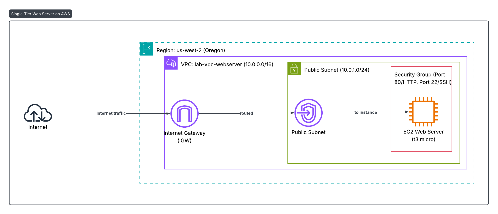
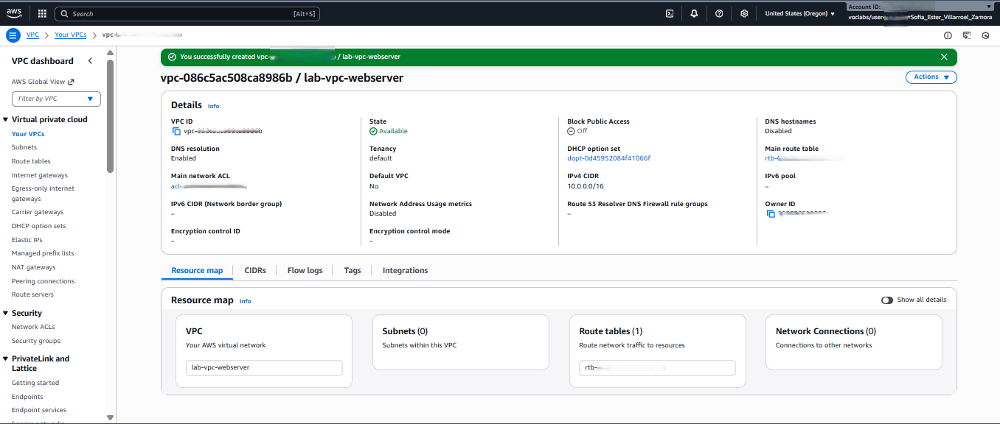
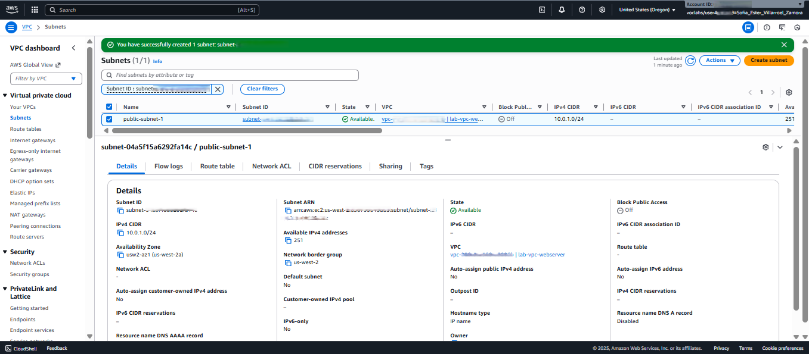
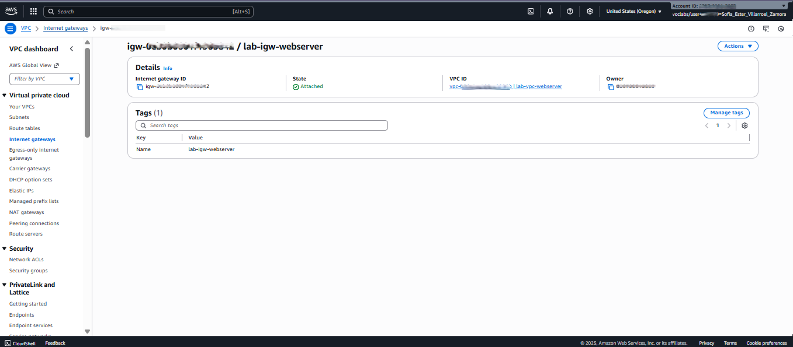
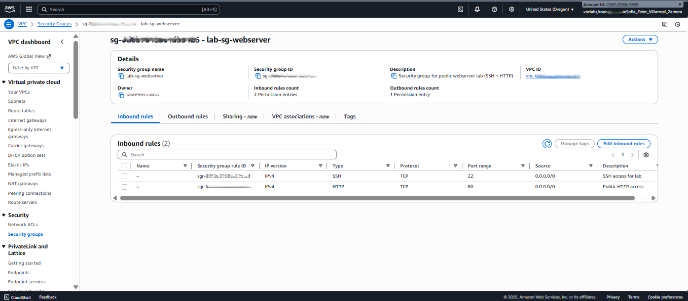
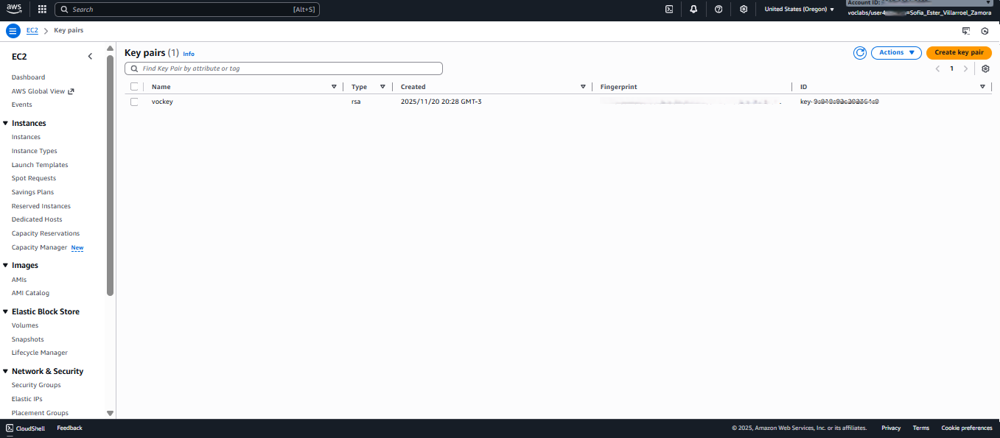
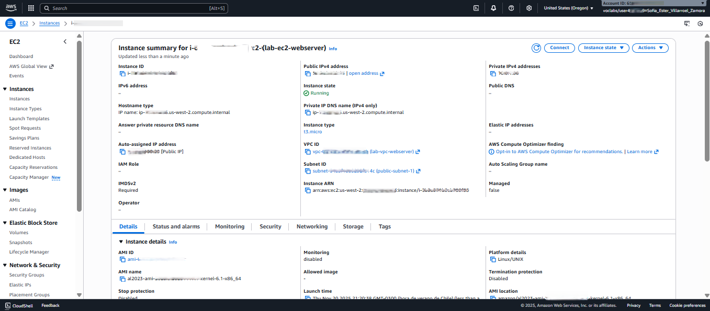
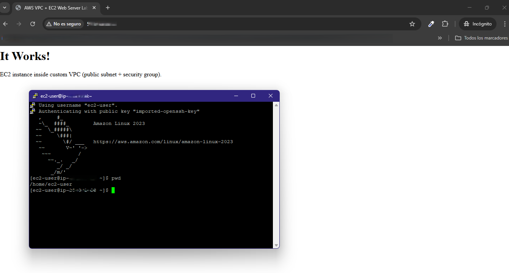
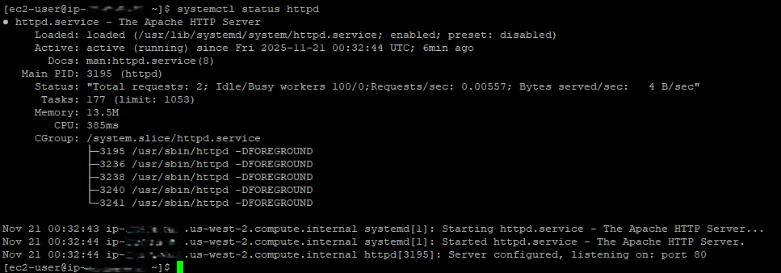

# ☁️ AWS VPC and EC2 Web Server Deployment Lab 🌐

## 📝 Overview
This project demonstrates the **manual deployment of a basic web server** within a **custom-defined AWS Virtual Private Cloud (VPC)**.

It serves as **proof of foundational Cloud and DevOps skills** by validating the ability to:
* Design and implement a custom **VPC architecture**.
* Configure **subnets**, **routing**, and **Internet Gateway (IGW)** for public connectivity.
* Establish **Network Security** using **Security Groups (SG)**.
* Automate application installation using **EC2 User Data** scripts.

The lab intentionally avoids using default AWS networking to demonstrate granular control over each component and its role in secure connectivity.

---

## 🏗️ Architecture Components
The solution is built using the following core AWS services and configurations:

* **Custom VPC:** CIDR Block $10.0.0.0/16$
* **Public Subnet:** CIDR Block $10.0.1.0/24$ (where the web server resides)
* **Internet Gateway (IGW):** Attached to the VPC to enable internet access.
* **Route Table:** Configured with a default route ($0.0.0.0/0$) pointing to the IGW.
* **Security Group (SG):** Configured to allow:
    * **SSH (Port 22):** Only from a restricted IP (for security).
    * **HTTP (Port 80):** From anywhere ($0.0.0.0/0$) to serve the web page.
* **EC2 Instance:** Running **Amazon Linux 2** ( t3.micro).
* **Web Server:** **Apache HTTP Server** installed automatically via a **User Data script** (`src/user-data/install-apache.sh`).

The following diagram illustrates the full architecture of this deployment, including the VPC, subnet, routing, internet gateway, security group, and EC2 instance.

---

## 🛠️ Execution Steps and Validation
The following steps were executed sequentially to provision the infrastructure and validate the web server deployment.

### 1. VPC Creation
The custom VPC was successfully created with the CIDR $10.0.0.0/16$.
* **Screenshot:** [VPC Overview](assets/screenshots/01-vpc-details-overview.png)

### 2. Subnet and Internet Gateway Configuration
A public subnet ($10.0.1.0/24$) was created, and the Internet Gateway was attached to the VPC.
* **Public Subnet:** [Public Subnet Details](assets/screenshots/02-public-subnet.png)
* **Internet Gateway:** [Internet Gateway Attached](assets/screenshots/03-igw-attached.png)

### 3. Routing Setup
The public route table was configured with a default route to the Internet Gateway, enabling outbound and inbound internet traffic for the public subnet resources.
* **Route Table:** [Public Route Table Configuration](assets/screenshots/04-route-table-public.png)

### 4. Security Group (Firewall)
A Security Group was established to act as an instance-level firewall, allowing only necessary traffic (SSH for management and HTTP for the web service).
* **Security Group:** [Security Group Rules](assets/screenshots/05-security-group.png)

### 5. EC2 Instance Provisioning
The EC2 instance was launched into the public subnet, associating the Security Group and utilizing a Key Pair for SSH access. The User Data script was included to automatically install Apache upon launch.
* **Key Pair:** [Key Pairs List](assets/screenshots/06-key-pairs-list.png)
* **Instance Details:** [EC2 Instance Details](assets/screenshots/07-ec2-instance-details.png)

### 6. Validation (SSH and Web Service)
Successful deployment was validated through SSH connection and confirming the Apache web server is running.
* **SSH Success:** [Successful SSH Connection](assets/screenshots/08-ec2-ssh-success.png)
* **Apache Running:** [systemctl status httpd](assets/screenshots/09-ec2-systemctl-httpd-running.png)

---

## 🖼️ Screenshots (Quick Reference)

| # | Component | Description | Screenshot |
| :---: | :--- | :--- | :---: |
| **1** | VPC Overview | Details of the custom VPC ($10.0.0.0/16$). |  |
| **2** | Public Subnet | Configuration of the public subnet ($10.0.1.0/24$). |  |
| **3** | Internet Gateway | IGW successfully attached to the VPC. |  |
| **4** | Route Table | Public Route Table with the default route to IGW. |  |
| **5** | Security Group | Configured rules (SSH + HTTP) for instance security. |  |
| **6** | Key Pair | Key pair used for secure SSH access. |  |
| **7** | EC2 Instance Details | Overview of the running EC2 instance. |  |
| **8** | SSH Connection | Validation of successful SSH connection. |  |
| **9** | Apache Status | Confirmation that the Apache service is running. |  |

***Note on Security:*** *Sensitive data, including full public IPs, Account IDs, and ARNs, has been masked in all screenshots to comply with security best practices.*

---

## 🧠 Lessons Learned
This activity provided valuable insights into foundational cloud networking and deployment best practices:

* **Networking Mastery:** I improved my understanding of how essential a **correct configuration of routes and Security Groups** is for resources within a VPC to connect and function properly.
* **Overcoming Challenges:** An initial difficulty involved the **public IP assignment**, which was resolved by thoroughly understanding the relationship between the network components (Subnet configuration and Route Table).
* **Design Rationale:** I reinforced the principle of **Least Privilege** by allowing **SSH only from my source IP** and HTTP publicly for the web server.
* **Time Management:** The experience emphasized the ability to **work focused under time pressure**.

## ✨ Improvements
To enhance the robustness and professionalism of this deployment, the following improvements are planned:

* **High Availability (HA):** The current architecture is single-AZ. The next step would be to redesign it to span **multiple Availability Zones** and implement an **Auto Scaling Group** for the EC2 instance to ensure business continuity.
* **Application Tier Separation:** Introduce a database/application tier in the **Private Subnet** (e.g., an RDS instance), isolating sensitive resources from the public internet, which is a key cloud security best practice.
* **Infrastructure as Code (IaC):** Refactor the deployment process using **Terraform** or **CloudFormation**. This will make the environment **reproducible, version-controlled,** and scalable, moving beyond manual provisioning.